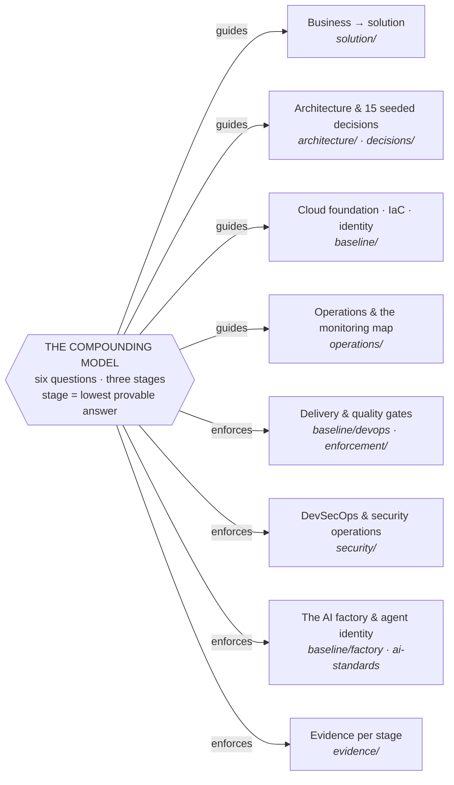

# The Compounding Model

**A tested and validated procedure that takes a software project — wherever it
stands today — to Stage 3 (Compounding) AI maturity.**

> Start here: run the [**AI assessment**](https://savvaniss.github.io/compounding-model/) — your own
> agent audits your repos and pipelines and grades you on evidence, not
> self-declaration ([prompt](assessment/ai-assessment-prompt.md)) — then hand
> your agent the [quick start](quick-start.md): it executes day one and stops
> only where a decision is genuinely yours.

This is not an opinion piece. Every gate, guard and standard in it was
**exercised in production by the AI agents it governs before it was written
down** — where a rule exists, its absence cost something first — and the
whole was **validated against a formal enterprise maturity framework**. It
contains no information about any specific project.

## Written for your agent, not for you

This repository's reader is an AI agent. Every document is written to be
fetched and executed: the [assessment](assessment/ai-assessment-prompt.md)
is a prompt, the [quick start](quick-start.md) is an instruction set,
[CLAUDE.md](CLAUDE.md) is the agent's contract, the runbooks are sized to
an agent's read window, and the standards are phrased as checks a tool
boundary can enforce. Your part is judgment: the marked decision stops,
the approval gates, the steering reviews. **Give it to your agent and
watch it do the job** — that is not a slogan, it is the operating
philosophy this repository exists to install: humans decide, agents
execute, and every execution leaves evidence.

## The model

Six questions, three stages. A team's stage is the **lowest answer it can
prove** — maturity is a chain, not an average:

1. **Stage 1 — Ad hoc**: AI is a personal tool.
2. **Stage 2 — Systematic**: AI is a team practice.
3. **Stage 3 — Compounding**: AI is part of the operating model, and every
   use makes the next one better.

| # | Question | Stage 1 — Ad hoc | Stage 2 — Systematic | Stage 3 — Compounding |
|---|---|---|---|---|
| 1 | Where does AI act? | isolated coding tasks | most delivery stages | end-to-end workflows incl. operations; agents queue prod, humans land it |
| 2 | Who does it act as? | shared keys, anonymous | named accounts | per-person agent identity; unattributed writes refused |
| 3 | What does it cost — is it worth it? | unknown | spend visible per tool | every call attributed + priced; unit-economics reviews change decisions |
| 4 | How good is its output? | vibes | human spot-review | judged: sampled verdicts, eval harness gating model swaps, honest "can't grade" |
| 5 | Does capability compound? | nothing persists | shared assets with owners | a factory: assets as code through their own gates; lessons served back during work |
| 6 | Who carries it? | a few enthusiasts | named champions per team | fluency in every role; daily usage proven from telemetry |

Every claim is proven with an artifact and the mechanism that produces it
continuously — see [maturity-model.md](maturity-model.md) and the
[evidence checklists](evidence/).

## What the model guides and enforces

The six questions are not a scorecard bolted onto a delivery system — they
**generate** it. Each question, taken seriously, demands a set of standards;
this repository is those standards, written down and wired to tool
boundaries:

| Category | What the model demands | Where |
|---|---|---|
| Business → solution | every build traces to a named outcome with a falsifiable value hypothesis; NFR targets agreed before design; effects measured after shipping | [solution/](solution/) |
| Decisions | start from **15 pre-accepted defaults** — cloud, IaC, identity, network, runtime, data, secrets, delivery, observability, AI access, APIs, docs-as-code, cost, DevSecOps, knowledge & work integration; disagree by superseding, never by drifting | [decisions/](decisions/) |
| Architecture | quality attributes drive structure; boundaries follow the domain; failure is designed per dependency; structure is enforced by fitness functions in CI — and the factory has its own hub-spoke infrastructure | [architecture/](architecture/) |
| Cloud foundation & IaC | a governed hierarchy with one isolation boundary per workload+environment; policy as code; Terraform on verified modules; pipeline-only state; drift is an incident — **with Azure · AWS · GCP mappings** | [baseline/cloud-foundation.md](baseline/cloud-foundation.md), [baseline/terraform.md](baseline/terraform.md) |
| Identity | groups + PIM for humans, federated identities for workloads, **agents act as the person driving them** — anonymous writes are refused | [baseline/identity.md](baseline/identity.md) |
| Delivery & quality | PR-only through the AI merge gate; build once, promote the artifact; guards refuse unsafe deploys; a human lands production; done means verified on the running system | [baseline/devops.md](baseline/devops.md), [baseline/quality.md](baseline/quality.md), [enforcement/](enforcement/) |
| Security | the scan lane rides the delivery pipeline (secrets/SAST/SCA/IaC/image/SBOM/signing/DAST); findings carry owners, SLAs and expiring suppressions; posture, SIEM and rotation run forever after | [security/](security/) |
| AI platform & factory | one model gateway with isolated quota; every call attributed and priced; output judged with honest "can't grade"; AI assets are code shipped through their own gates; every agent connects through **one MCP socket** for every question and action | [baseline/ai-standards.md](baseline/ai-standards.md), [baseline/factory.md](baseline/factory.md) |
| Knowledge & work | the wiki of record and the work tracker are **live tools**: federated search, attributed comments; **an action without a ticket never happened**; agents never open tickets unasked | [baseline/knowledge-work-integration.md](baseline/knowledge-work-integration.md) |
| Operations & monitoring | SLOs with error budgets; incidents become lessons the AI serves back; seven monitoring altitudes, each with an owner; **failed ≠ empty** | [operations/](operations/) |
| Evidence & people | champions with mandated time; every stage claim proven by an artifact and the mechanism producing it | [evidence/](evidence/), [templates/](templates/) |

## Navigate by role

- **Sponsor / product owner** — [solution/business-to-solution.md](solution/business-to-solution.md), then the monitoring map's top row.
- **Architect** — [decisions/](decisions/) (the seeded ADR baseline), [architecture/practice.md](architecture/practice.md), [solution/nfr-catalogue.md](solution/nfr-catalogue.md), [architecture.md](architecture.md) (system diagrams + the thirteen utilities).
- **Platform / DevOps engineer** — [roadmap.md](roadmap.md), [baseline/](baseline/), [enforcement/](enforcement/).
- **Security lead** — [security/secure-delivery.md](security/secure-delivery.md), [security/security-operations.md](security/security-operations.md), [baseline/identity.md](baseline/identity.md).
- **Engineering / delivery lead** — [baseline/development.md](baseline/development.md), [baseline/quality.md](baseline/quality.md), [operations/sre.md](operations/sre.md), [evidence/](evidence/).
- **AI agent joining the project** — [CLAUDE.md](CLAUDE.md) is written for you.

## How to use this repository

You don't work through it — your agent does. What you watch happen:

1. **It assesses you**: the agent runs the [AI assessment](assessment/ai-assessment-prompt.md)
   against your real repos and pipelines — the verdict names your weakest links.
2. **It stands up day one**: hand it the [quick start](quick-start.md); it builds
   the rails and stops only at human decision points.
3. **You decide**: the agent presents the [decision baseline](decisions/);
   your disagreements become superseding ADRs, today.
4. **It builds the factory**: from
   [architecture/factory-infrastructure.md](architecture/factory-infrastructure.md)
   the agent provisions the factory's own spoke as IaC through the pipeline,
   then builds the [thirteen utilities](architecture.md) in order — the
   enforcement spine (1–4) first — each landing as a gated PR, registered
   at birth. The factory is not installed; **it is built by the agent it
   will govern.**
5. **It attaches delivery to value**: the [solution front-half](solution/) —
   intake, business cases with falsifiable hypotheses, NFR targets, benefits
   checks measured after shipping.
6. **It builds on rails**: the [baseline](baseline/) standards, made real by
   [enforcement](enforcement/) — a rule not enforced at a tool boundary is a
   wish.
7. **It operates**: the [monitoring map](operations/monitoring-map.md) and
   [SRE practice](operations/sre.md); incidents feed the lessons library it
   serves back to the team.
8. **It keeps the evidence green** ([evidence/](evidence/)) so validation is
   an export, not an archaeology project — the [roadmap](roadmap.md)
   sequences all of this into four weeks.

## The invariants

> Humans decide, agents execute, every execution leaves evidence. Trace
> every build to a business outcome; enforce the invariant, not a ban;
> measure what you cannot enforce; write down every lesson with what it
> cost; and let the factory ship itself through its own gates.
