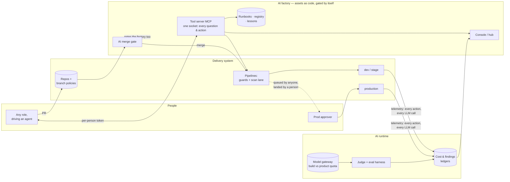
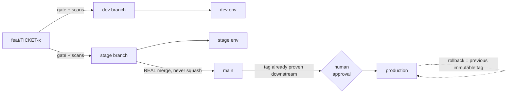

# Architecture: the factory, its utilities, and the scope of each

## The system at a glance



The load-bearing edge is `DEV ↔ MCP`: every developer's agent connects to
the tool server at session start with a per-person token, and **all** team
questions (runbooks, telemetry, status) and actions (deliver, deploy,
ticket) flow through that one socket — enforcement, attribution and
knowledge ride the same connection (see baseline/factory.md).

## The delivery loop

```mermaid
sequenceDiagram
  actor A as Agent (as its human)
  participant G as AI gate + scan lane
  participant P as Pipeline guards
  participant E as Environment
  participant T as Ticket
  A->>G: PR — ticket in branch + title
  G-->>A: findings: secrets/SAST/SCA/IaC + LLM review — file:line · why · fix
  A->>G: fix & push (gate re-runs) — or a human: /gate override: reason
  G->>P: merge → build once (tag = release; image scanned, SBOM, signed)
  P->>P: guards: tag exists? build reason ≠ CI? approval check present?
  P->>E: deploy + migrations
  P->>E: verify — rollout converged AND endpoint answers
  P->>T: report outcome with links
```

## Environments & promotion



## Utilities to build — scope of each

| # | utility | scope (what it does) | out of scope | size |
|---|---|---|---|---|
| 1 | **AI merge gate** | deterministic checks (ticket, branch, secret scan) + full-diff LLM review; PR thread + commit status; override on the record, scoped per push; run telemetry | auto-fixing code; replacing human review of design | M |
| 2 | **Tool server (MCP)** | team ops as tools: deliver, deploy, PR, ticket comment, runbook fetch, telemetry query; per-person token auth; guard rules from `enforcement/` | being a general chat bot; storing secrets | M–L |
| 3 | **Change-delivery orchestrator** | one call: build → layered build → deploy → migrate → verify → report on ticket; refuses production (queue-only) | approving production; schema design | M |
| 4 | **Pipeline guard library** | tag-exists, build-reason, approval-check-present, promotion-ancestry checks, shared by all queuing paths | replacing branch policies | S |
| 5 | **Console / hub** | env status + sleep/wake, delivery metrics, cost view (fold `MC_*`), people view, usage panel (busy/quiet/can't-tell), runbook browser, assistant | BI platform; long-term warehouse | L |
| 6 | **Cost ledger + rate table** | per-call attribution rows; effective-dated per-1M prices; read-time pricing; unpriced-model detection with as-billed names | invoicing; provider rate negotiation | M |
| 7 | **LLM judge + eval harness** | sampled groundedness/coverage verdicts; NOT-GRADEABLE honesty; harness: golden tasks × candidate models, quality scores + cost per candidate | fine-tuning; human eval program | M |
| 8 | **Usage sweep + activity table** | parse app logs → attributed action rows every ~2 min into persistent store; feature parsers added per log line | client-side analytics SDKs | S |
| 9 | **Docs guard + registry check** | size cap per runbook, credential-shape scan, registry-row-in-same-commit check | grammar/style enforcement | S |
| 10 | **Drift detector (infra)** | weekly `terraform plan` against live, red on diff, report to team channel | auto-apply of drift | S |
| 11 | **Agent-health watchdog** | daily probe that the gate, orchestrator & tool server still function; alerts on silence | APM replacement | S |
| 12 | **Directory enrichment** | at-sign-in claims/`/me` capture → user attributes (country, department); aggregate-first reporting | tenant-wide scraping without consent | S–M |
| 13 | **Security findings ledger** | one queue from all scanners (SAST/SCA/IaC/image/DAST/posture); severity SLAs per owner; suppressions with expiry; release-delta report | being a SIEM; fixing findings itself | S–M |

Sizes: S ≈ days, M ≈ 1–2 weeks, L ≈ 3+ weeks, one experienced builder with an
AI agent. Order of build = the numbering; 1–4 are the enforcement spine and
come first (see [roadmap.md](roadmap.md)).

Where each utility physically runs — the factory as a spoke in the hub-spoke
topology, with identity, exposure and failure design per component — is in
[architecture/factory-infrastructure.md](architecture/factory-infrastructure.md).
