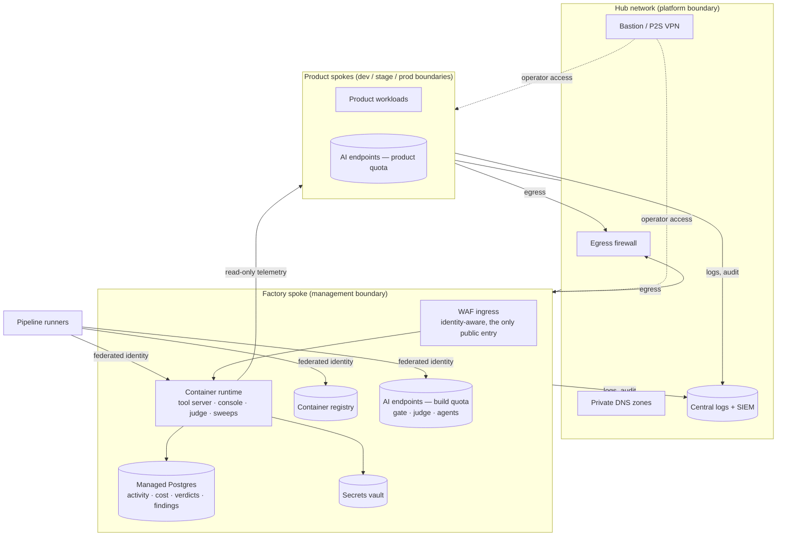

# Factory infrastructure — where the machinery itself lives

The factory (gate, tool server, console, ledgers, model access) is a
workload like any other and follows every standard in this blueprint:
its own isolation boundary and spoke, IaC-provisioned, tagged, registered,
cost-tracked, private-first. **It never shares infrastructure with the
product** — the machinery that governs delivery must not fail, scale or
bill together with the thing it delivers.

## Topology — the factory as a spoke

Peering is hub-to-spoke only; the factory spoke and product spokes never
peer directly — the factory reads product telemetry through private
endpoints and queries, not through network adjacency.

## Placement of each utility

| # | utility | runs where | identity | exposure | data |
|---|---|---|---|---|---|
| 1 | AI merge gate | pipeline job on CI runners — no standing infra | pipeline's federated identity | none | verdicts → factory DB |
| 2 | Tool server (MCP) | container app in the factory spoke | workload identity; callers: per-person signed tokens | via WAF ingress, identity-aware; private path from VPN | none of its own — reads vault, writes activity rows |
| 3 | Change-delivery orchestrator | pipeline definition, guarded at the queuing tool layer | pipeline federated identity | none | run reports → tickets |
| 4 | Guard library | the queuing tool layer (MCP/CLI); pipelines carry the same checks as backstops | — | none | — |
| 5 | Console / hub (web) | container app in the factory spoke | workload identity; users via workforce SSO on the ingress | via WAF ingress, SSO-gated — **never anonymous** | reads factory DB, cost APIs |
| 6 | Cost ledger + rate table | tables in factory Postgres; writers are the product apps' telemetry path | product workload identities, insert-only | private endpoint only | factory DB |
| 7 | Judge + eval harness | jobs on the factory runtime | workload identity | none | verdicts → factory DB |
| 8 | Usage sweep | scheduled job, factory runtime | read-only on product logs | none | activity rows → factory DB |
| 9–11 | docs guard, drift detector, watchdog | pipeline/scheduled jobs | federated identity | none | reports → team channel + DB |
| 12 | Directory enrichment | in the product's sign-in path | delegated user token | — | product DB (min. attributes) |
| 13 | Security findings ledger | tables in factory Postgres, fed by scan stages | pipeline identities, insert-only | private endpoint only | factory DB |

## Standards applied (the same rules, no exceptions)

- **Network (ADR-004):** every PaaS dependency of the factory — Postgres,
  Key Vault, registry, AI endpoints — sits behind a private endpoint with
  hub-managed DNS. Exactly two things are reachable from outside: the WAF'd
  ingress (console + tool server, both identity-gated) and nothing else.
  Operators come in through bastion/VPN.
- **Identity (ADR-003):** the runtime uses workload identity; humans reach
  the console via workforce SSO; agents reach the tool server with
  per-person short-lived tokens. No API keys between factory components.
- **AI access (ADR-010):** the factory's AI endpoints (gate reviews, judge,
  agents) hold **build quota**, deployed in the factory spoke; product
  models hold product quota in their own spokes. A noisy review day cannot
  throttle a customer feature, and vice versa.
- **Data (ADR-006):** one managed Postgres for factory state (activity,
  cost, verdicts, findings); insert-only grants for writers; backup and
  tested restore like any tier-2 store.
- **Cost (ADR-013):** the factory is tagged as its own workload, so "what
  does the AI machinery cost" is a subscription filter — and it appears in
  the same unit-economics review it enforces on everyone else.
- **IaC + registry (ADR-002, ADR-012):** the factory spoke is provisioned
  by the same Terraform standards it audits, and every resource has its
  registry row from the commit that created it.

## Failure design for the machinery

- **Gate down:** deterministic checks (secret scan, ticket, branch) fail
  **closed** — they are cheap and local. The LLM review fails **open with a
  loud degraded verdict** on the PR: an unavailable reviewer must not block
  all delivery, but it must never fail silently as "passed".
- **Tool server down:** agents lose their hands; humans fall back to the
  CLI wrapper, which carries the same guards — raw pipeline access during
  the outage is emergency-only and audited; the watchdog (#11) alerts
  within the day, and the outage is an incident like any other.
- **Factory DB down:** product runtime is unaffected by design (telemetry
  writers buffer or drop, never block the request path); dashboards show
  "can't tell", never zeros.
- **Model endpoint throttled:** gate and judge degrade to sampling before
  they degrade to silence; throttling-shaped errors are retried, quota is
  reviewed with capacity (../operations/sre.md).

Bootstrap note: the factory spoke arrives as the factory's first gated
delivery (roadmap week 2); until it lands, the week-1 gate and pipelines
run on CI runners against an interim model endpoint, with plain branch
policies as the backstop — from then on the factory ships itself through
its own gates.