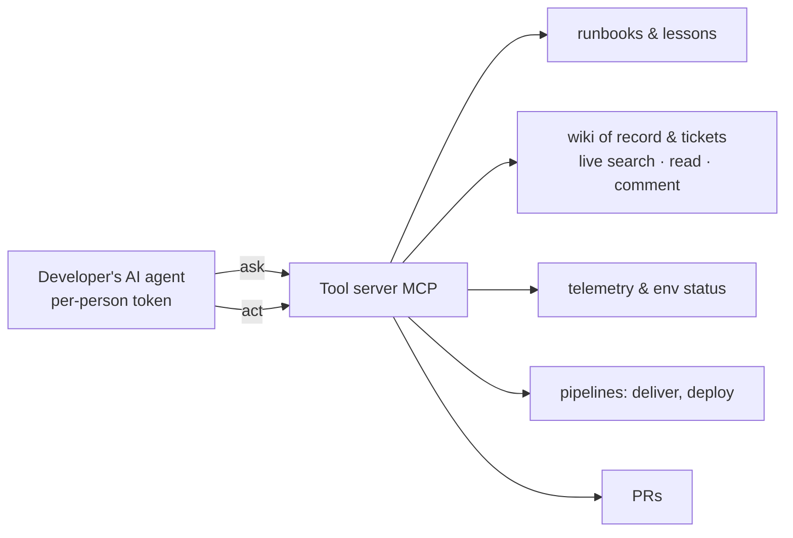

# The factory — reusability as code (Stage 3's backbone)

The factory is the difference between "we use AI" and "our delivery system is
AI-operated": every AI asset versioned, reviewed and deployed like the
product, integrating most SDLC stages.

## The connection pattern — one socket for everything

Every developer runs an AI agent (IDE, CLI, chat — the tool doesn't
matter). At session start the agent **connects to the team's tool server
(MCP) with that person's short-lived token**, and from then on **every
team question and every team action goes through it**:

- **Questions** — "how do we deploy?", "is anyone on the system?", "what
  went wrong last time?", "what did we decide about X?" — are answered
  from the runbook library, the telemetry tables, the lessons entries,
  the wiki of record and the ticket history, *in the agent's context*,
  not from tribal memory (baseline/knowledge-work-integration.md).
- **Actions** — deliver a change, queue a deploy, comment the ticket — run
  as tools, so every guard fires and every call lands attributed to the
  person driving.
- **Nothing goes around it.** Agents hold no raw credentials to pipelines,
  clusters or trackers; the tool boundary is where rules are enforced and
  usage is measured. If an operation has no tool, that is a factory gap to
  raise — not a reason to improvise around the boundary.

This single pattern is what turns "the team uses AI" into an operating
model: enforcement, attribution, and shared knowledge all ride the same
socket.

## Components
- **MCP / tool server**: the team's operational tools (deploy, PR, ticket,
  telemetry, runbook retrieval) behind per-person tokens; rules *enforced* at
  the boundary with reasons, *measured* where they cannot be enforced.
- **Console/hub**: environment status & sleep/wake, delivery metrics, cost
  ledger, people view (who did what through the AI), usage panel, runbook
  library, an assistant wired to live tools.
- **The AI merge gate** (see enforcement/pr-gate.md) — the single most
  valuable asset: it blocked its own author repeatedly with real findings.
- **Runbooks as code**: flat files, one topic each, size-capped to the
  assistant's read window, category by filename prefix.
- **REGISTRY.md**: every created asset, in the creating commit.
- **Lessons-learned**: every incident becomes an entry carrying its evidence
  (error text, command, numbers). A lesson without evidence is an opinion.

## The recursive property that convinces validators
The factory **ships itself through its own gates**. Changes to the gate are
gated; pipeline changes ride pipelines; the registry records the registry.
Show one PR where the AI gate blocked a change *to the factory* with a real
finding — that artifact alone demonstrates Stage 3 (Compounding)
better than any slide.
