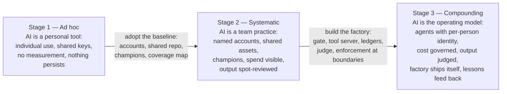

# Evidence — proving your stage

The [maturity model](../maturity-model.md) defines **three stages** across
six questions. This folder is how you prove which one you are at.

## The rules of proof

- **Your stage is the lowest answer you can prove.** Six questions, one
  proven answer each; the weakest one is your stage — maturity is a chain,
  not an average.
- **Artifact or it doesn't count.** Each claim names an artifact (a ledger
  row, a blocked PR, a telemetry query) *and the mechanism that produces it
  continuously*. Build the mechanism, not the screenshot.
- **Validity expires.** Re-prove on a cadence (quarterly for Systematic,
  per validation cycle for Compounding). Evidence as a by-product of the
  running system is the only sustainable way to pass.

## Which checklist

| you claim | use | what a validator sees |
|---|---|---|
| Stage 1 — Ad hoc | nothing to prove; it is the starting state | — |
| Stage 2 — Systematic | [systematic-checklist.md](systematic-checklist.md) | reviewed tables, mapped accounts, shared repo |
| Stage 3 — Compounding | [compounding-checklist.md](compounding-checklist.md) | the running system, live — gate verdicts, ledgers, refusals |

## What "validation" means here

A validation is a skeptical review — by an external assessor, an internal
audit function, or simply a leader who refuses claims without artifacts —
that walks the applicable checklist and accepts only evidence produced by
the running system. Its verdict is **time-boxed**: it certifies the cycle
it examined, and expires unless re-proven on the cadence above. Any formal
maturity framework your organization uses can sit on top of this — the six
questions and their artifacts are the substrate such frameworks ask for.

There is no stage above Compounding to chase: past it, the work is keeping
the six answers true as the team, the models and the product change.
