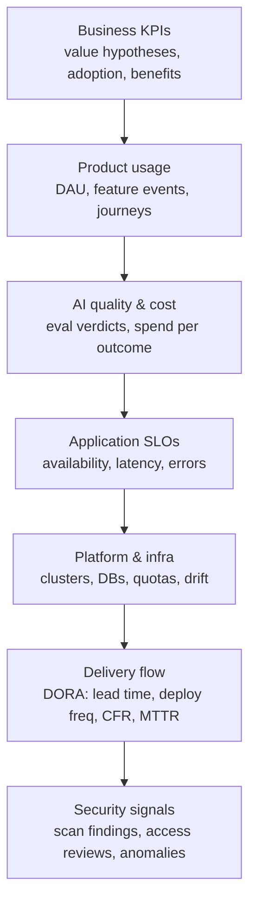

# The monitoring map — one system, seven altitudes

"Monitor all of this" fails when each layer is someone else's dashboard.
This map assigns every altitude a source, an owner and a review cadence —
and one rule binds them all: **failed ≠ empty. A broken collector must render
as "can't tell", never as a good number.**

| altitude | typical source | owner | cadence |
|---|---|---|---|
| Business KPIs | product analytics + finance | product owner | monthly steering |
| Product usage | attributed action events, DAU telemetry | product owner | weekly |
| AI quality & cost | eval loop verdicts + cost ledger | tech lead | monthly cost/quality review |
| Application SLOs | APM/RUM, synthetic probes | service owner | weekly + on budget burn |
| Platform | cloud monitor, drift detector, quota tables | platform owner | weekly |
| Delivery flow | pipelines + repo events (DORA four keys) | delivery lead | per retro |
| Security | scanners, access reviews, audit logs | security champion | monthly + on event |

Two design rules:
1. **Every altitude answers a decision**, not curiosity: stop/start prod
   (usage), pause releases (error budget), change model mix (cost/quality),
   staff reliability work (DORA + SLO).
2. **The top row is the point.** If business KPIs and benefits checks are
   missing, the rest is a very well-instrumented mystery.
