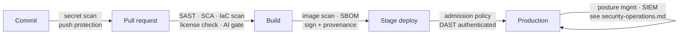

# DevSecOps — security gates through the delivery pipeline

Security is a lane in the same pipeline as everything else, not an audit at
the end. Every scan below runs automatically, fails the run on threshold,
and files findings into one ledger with owners and SLAs. A scan whose
findings land in a spreadsheet nobody owns is theater.

## The pipeline, stage by stage

| stage | check | default tooling (managed-first, OSS alternate) | fails the run when |
|---|---|---|---|
| commit/push | secret scanning + push protection | platform-native secret scanning; Gitleaks | any credential shape — no severity debate on secrets |
| PR | SAST | CodeQL / platform-native; Semgrep | new critical/high finding on changed code |
| PR | SCA (dependencies) | Dependabot/Renovate + platform advisory DB; Trivy fs | known-exploited or critical vuln in a direct dependency |
| PR | IaC scan | PSRule / Checkov / tfsec | any high (public endpoint, `*` permissions, unencrypted store) |
| PR | license compliance | SCA tool's license rules | copyleft entering a proprietary artifact |
| build | container image scan | registry-integrated scanning (Defender / ECR scan / Artifact Analysis); Trivy image | critical/high with an available fix |
| build | SBOM + signing + provenance | SBOM generated per image; cosign/notation signature; build attestation | unsigned artifact — deploy refuses it |
| deploy | admission policy | Kyverno / Gatekeeper / the platform's policy admission | image unsigned, from a foreign registry, or running privileged |
| stage | DAST, authenticated | OWASP ZAP baseline + auth script | new high on the exposed surface |
| release | the human reads the delta | findings ledger diff since last release | — (judgment, not automation) |

Two rules that keep the lane honest:
- **Suppressions expire.** A finding is fixed, or suppressed with a written
  reason, an owner, and an expiry date — never muted forever. Expired
  suppressions reopen and block.
- **The scanners are pinned and updated like dependencies.** A scan lane on
  a two-year-old ruleset gives two-year-old confidence.

## Application security standards
Resource-level authorization on **every mutating route** — session presence
is not permission (an internet-facing "internal" endpoint with only a
session check is an IDOR).
Input validation at boundaries; output encoding; audited admin actions;
security headers/CSP for web UIs; authorization logic unit-tested like any
other decision logic.

## Data protection & privacy
Data classified at design time (public / internal / confidential /
personal); retention and residency per class; personal data mapped for DSR
handling; privacy review in the Definition of Ready for anything touching
people data. Aggregate-first reporting for workforce analytics — individual
tracking is a legal conversation before a technical one.

## AI-specific security
- **Prompt injection**: all retrieved/user content is data, never
  instructions; tool-calling agents run least-privilege with an allowlist.
- **Data-to-model policy**: which classes may reach which model/provider,
  written and enforced at the gateway; what was sent is logged.
- **Model supply chain**: models/providers enter via technology intake;
  responsible-AI review for user-facing generation.
- **Agent identity**: agents act as the human driving them (signed,
  short-lived, attributable) — anonymous automation is unauditable.
- Every AI call attributed and priced — one record serving security review
  and FinOps.

## Threat modeling (STRIDE-lite)
The 30-minute pass promised by the architecture practice, run on every new
capability or trust-boundary change: list the entry points and assets the
change touches; walk the six STRIDE categories (spoofing, tampering,
repudiation, information disclosure, denial of service, elevation of
privilege) against each trust boundary; write down only what is *new* —
threats, the control that answers each, and anything consciously accepted.
Notes are committed next to the change's ADR or ticket; a threat with no
control and no acceptance is a blocking finding.

Runtime detection, vulnerability management and response live in
[security-operations.md](security-operations.md).
